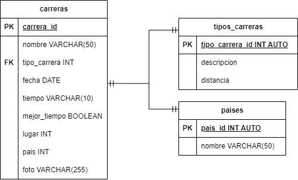

# MARATONES

## Listado de Entidades

### carreras **(ED)**

- carrera_id **(PK)**
- nombre
- tipo_Carrera **(FK)**
- fecha
- tiempo
- mejor Tiempo
- altitud
- lugar **(FK)**
- pais
- foto

### tipos_carreras **(EC)**

- tipo_carrera **(PK)**
- descripcion
- distancia

### paises **(EC)**

- paises_id **(FK)**
- nombre **(UQ)**

## Relaciones

1. Una **carrera** _Pertenece_ a un **tipo de carrera**(_1 a 1_).
2. Una **carrera** se _Corre_ en un **país**.(_1 a 1_)

### Modelo Relacional de la base de datos

## Reglas de Negocio

### carreras

1. Crear el registro de una carrera
1. Leer el registro de una(s) carrera dada una condicion en particular
1. Actualizar los datos de una carrera
1. Actualizar los datos de una carrera ada un condicion en particular
1. Eliminar los datos de una carrera dada una condicion en particular

### tipos_carreras

1. Crear el registro de un tipos_carreras
1. Leer el registro de uno(s) tipos_carreras dada una condicion en particular
1. Actualizar los datos de una tipos_carreras
1. Actualizar los datos de una tipos_carreras ada un condicion en particular
1. Eliminar los datos de una tipos_carreras dada una condicion en particular

### paises

1. Crear el registro de una pais
1. Leer el registro de uno(s) pais dada una condicion en particular
1. Actualizar los datos de una pais
1. Actualizar los datos de una pais ada un condicion en particular
1. Eliminar los datos de una pais dada una condicion en particular